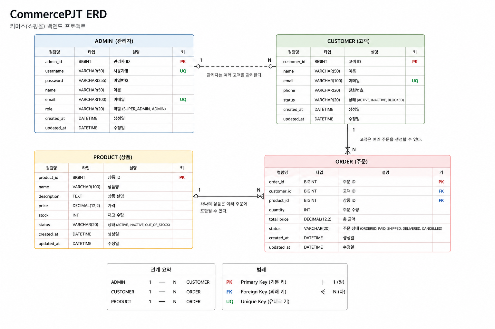

#  CommercePJT

> **Spring Boot와 JPA를 활용하여 개발한 커머스(쇼핑몰) 백엔드 프로젝트**입니다.
> 고객, 상품, 주문, 관리자 기능을 REST API 기반으로 구현하며, 계층형 아키텍처와 객체지향 설계를 적용했습니다.

---

#  프로젝트 소개

CommercePJT는 온라인 쇼핑몰의 핵심 기능을 구현한 백엔드 프로젝트입니다.

고객(Customer), 상품(Product), 주문(Order), 관리자(Admin) 기능을 도메인별로 분리하여 개발하였으며, Spring Boot와 JPA를 활용해 RESTful API를 구현했습니다.


* Spring Boot 기반 REST API 개발
* Spring Data JPA를 활용한 데이터 관리
* 3-Layer Architecture 적용
* DTO를 활용한 계층 간 역할 분리
* Git/GitHub를 이용한 협업
* 예외 처리 및 Validation 적용

---


#  프로젝트 구조

```text
src
└── main
    └── java
        └── com.example.commercepjt
            ├── admin
            ├── customer
            ├── product
            ├── order
            ├── common
            └── CommercePjtApplication
```

각 도메인은 다음과 같은 구조를 따릅니다.

```text
customer
├── controller
├── service
├── repository
├── entity
└── dto
```

3-Layer Architecture를 적용하여 Controller, Service, Repository의 역할을 명확하게 분리했습니다.

---

#  ERD


```md

```

---

#  API 명세

## Customer

| Method | URL                     | Description |
| ------ |-------------------------| ----------- |
| GET    | `/customers`            | 고객 목록 조회    |
| GET    | `/customers/{id}`       | 고객 상세 조회    |
| PATCH  | `/customers/{id}`       | 고객 정보 수정    |
| PATCH  | `/customers/{id}/status` | 고객 상태 변경    |
| DELETE | `/customers/{id}`       | 고객 삭제       |

---

## Product

| Method | URL                     | Description |
| ------ |-------------------------|-------------|
| POST   | `/products`             | 상품 등록       |
| GET    | `/products`             | 상품 목록 조회    |
| GET    | `/products/{id}`        | 상품 상세 조회    |
| PATCH  | `/products/{id}/status` | 상품 상태 수정    |
| DELETE | `/products/{id}`        | 상품 삭제       |

---

## Order

| Method | URL                   | Description |
| ------ |-----------------------|-------------|
| POST   | `/orders`             | 주문 생성       |
| GET    | `/orders`             | 주문 목록 조회    |
| GET    | `/orders/{id}`        | 주문 상세 조회    |
| PATCH  | `/orders/{id}/status` | 주문 상태 변경    |
| PATCH  | `/orders/{id}/cancle` | 주문 취소 변경    |

---

## Admin

| Method | URL                            | Description   |
|--------|--------------------------------|---------------|
| POST   | `/admins/signup`               | 관리자 회원가입      |
| POST   | `/admins/login`                | 관리자 로그인       |
| POST   | `/admins/logout`               | 관리자 로그아웃      |
| GET    | `/admins/{id}`                 | 관리자 상세조회      |
| GET    | `/admins`                      | 관리자 전체조회      |
| PATCH  | `/admins/{id}`                 | 관리자 정보 수정     |
| PATCH  | `/admins/{id}/status`          | 관리자 상태 변경     |
| PATCH  | `/admins/{id}/approve(reject)` | 관리자 승인(거부) 변경 |

---


### 3. MySQL 설정

`application.yml`

```yaml
spring:
  datasource:
    url: jdbc:mysql://localhost:3306/commerce
    username: root
    password: 12345678

  jpa:
    hibernate:
      ddl-auto: update
```

---

#  주요 기능

###  Customer

* 고객 목록 조회
* 고객 상세 조회
* 고객 정보 수정
* 고객 상태 변경
* 고객 삭제

###  Product

* 상품 등록
* 상품 조회
* 상품 수정
* 상품 삭제

###  Order

* 주문 생성
* 주문 조회
* 주문 상태 변경

###  Admin

* 고객 승인
* 상품 승인

---

#  담당 역할

| 이름  | 담당 기능    |
|-----|----------|
| 최정윤 | Admin    |
| 신형탁 | Admin    |
| 임경식 | Admin    |
| 김혁중 | Customer |
| 장준혁 | Product  |
| 최정이 | Order    |
---


